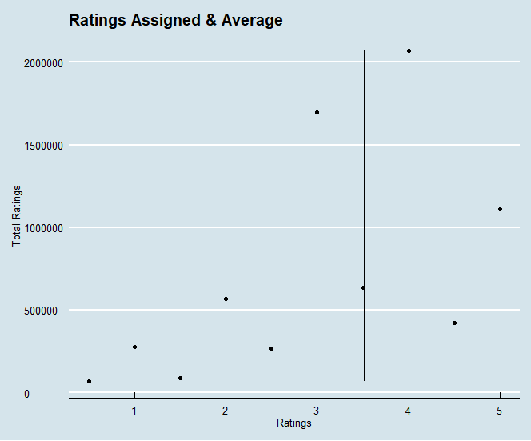
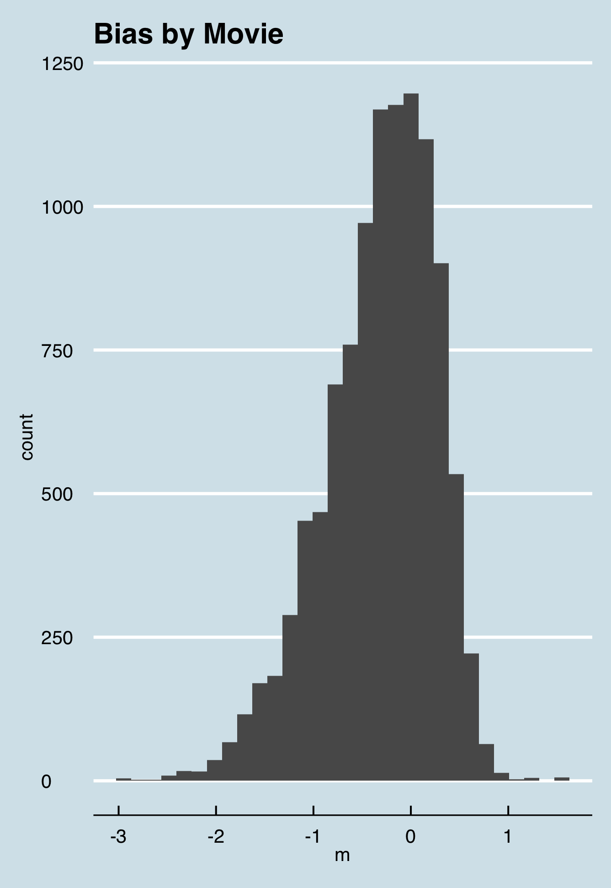
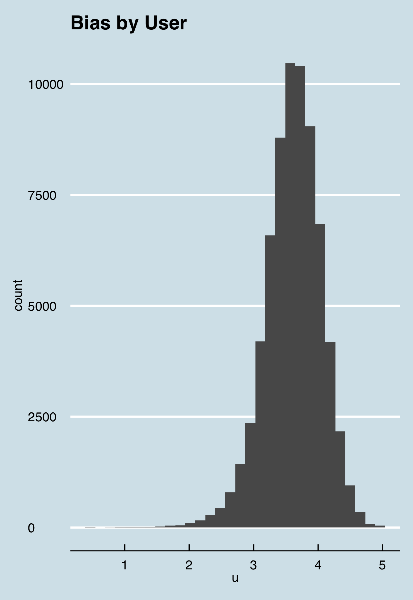
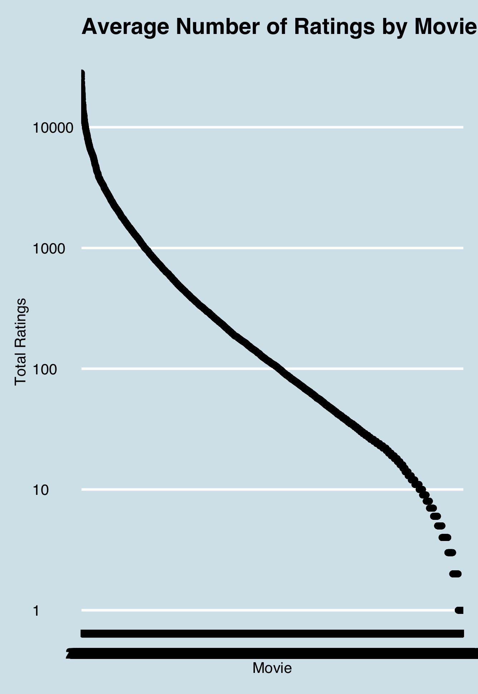
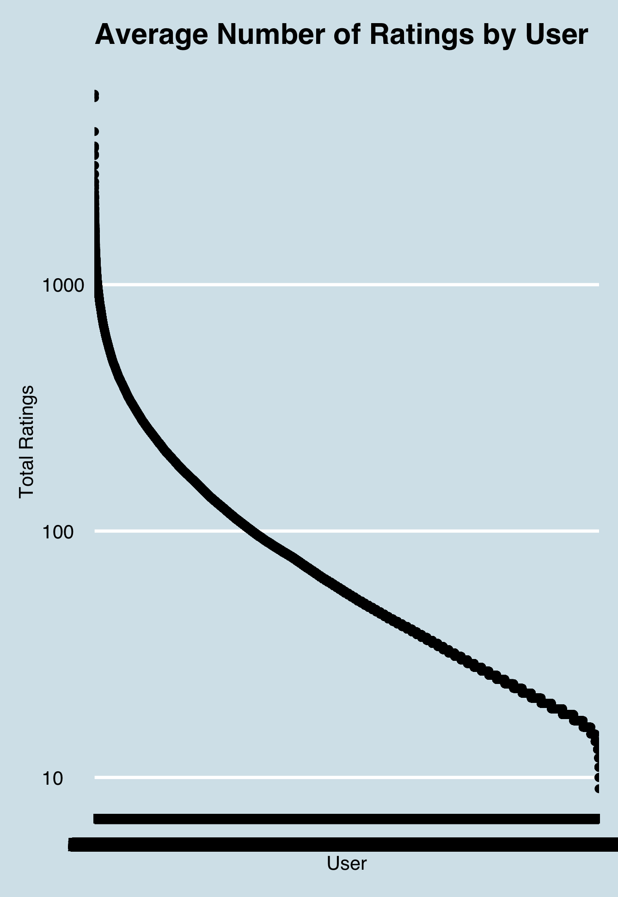
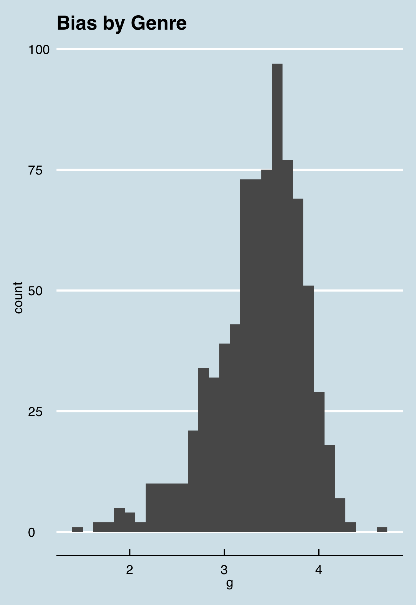
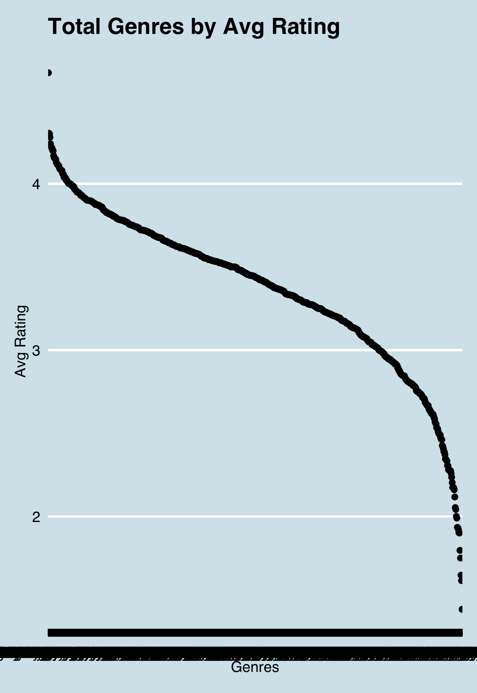
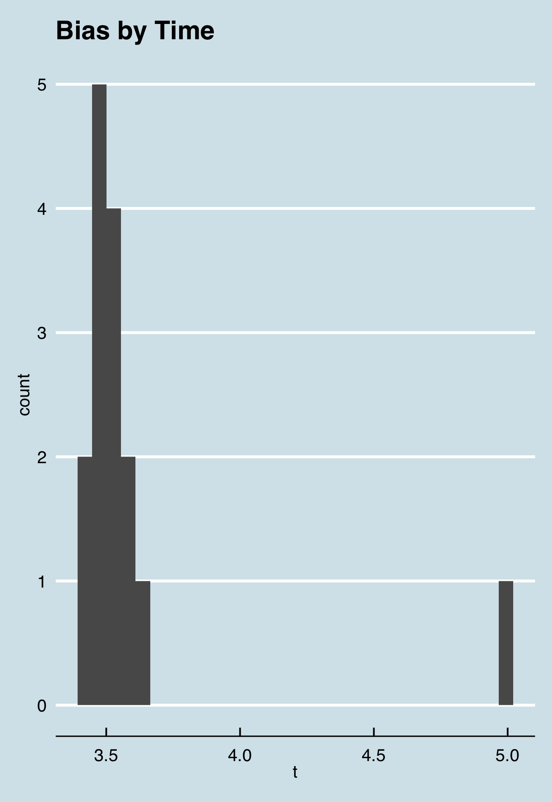

```
{r setup, include=FALSE},
knitr::opts_chunk$set(echo = TRUE)
```

# MovieLens Data Science Capstone Project

Author: David Keim

Course: HarvardX Professional Certificate in Data Science: Capstone

## Executive Summary

For this project I was provided with a dataset of roughly 10 million individual movie ratings by 71 thousand individual users on 10 thousand different movies. The goal of this project is to develop a machine learning algorithm using the skills and data science techniques developed over this course on a subset of this dataset (90% of the total data). We also interacted with a rather similar dataset in Course 8 of this certificate that gave us some starting tools to work off of. Then, this algorithm will be run and validated against the validation set (the remaining 10%) using root means squared error (RMSE) to determine its effectiveness. We will be using R, a statistical analysis focused coding language, and various additional packages to build our algorithm.

All of the code and figures are within the same repository as this document. For clarity, I only include some chunks within this document.

## Analysis and Methods

We begin our analysis by further subdividing the edx set given to us as a training set into another training and test set. This will help give us a check without using the final validation set and thus potentially overfitting our algorithm to the data.

We will then begin studying what factors are available to us in the dataset. Based on the limited amount of variables, our previous work with this dataset in the course and this paper that is a summary of how the Netflix Challenge winners developed their algorithm ([link](http://blog.echen.me/2011/10/24/winning-the-netflix-prize-a-summary/)), we know that our algorithm will have to take into account the following factors: A Baseline rating of all movies (which we call Mean), Average Rating of that specific movie (M), Average rating of that specific user (U), Genre and how it affects the user’s rating (G), and the Timestamp when the rating was completed (T).

A particular challenge of this dataset is that it is so large and so sparse. Although there are roughly ten thousand movies in the dataset, the median user has only reviewed 50 and some movies only have a handful of ratings. This results in many observations of many unique movies with few overlaps, an unbalanced dataset. This will require some regularization to ensure that our ratings aren't skewed by the edge cases. This also prevents using the entire dataset in training and building the model with a more simple linear regression, as that would crash R.

 We start our search for the baseline rating of all movies and find that the user average rating across all movies is roughly 3.5 and that whole star reviews are much more common than half star. We can run the most basic model by assigning the overall average as our prediction. This is the best we can do without modelling individual effects within the data.

```
#First Attempt: Mean for every rating
#Find averge of all ratings
mean_hat <- mean(train_set$rating)
mean_hat
#Calculate RMSE
mean_rmse <- RMSE(test_set$rating, mean_hat)
mean_rmse
```

### Mean Model RMSE - 1.06

 The first effect we will model is the Movie Effect (M). What we mean by movie effect is that each individual movie has an overall average rating which tells us if any given user might find that movie good or bad. So a good movie might be , with an average rating of ,() and a bad movie might be , with an average rating of. The range of bias in these movies is visualized by the spread of this graph. We add this to our model , have it run predictions against our test set, and compute the RMSE. We see that just by adding one effect, the RMSE drops significantly.
```
#Second Attempt: Movie Effect Model
#Estimate Movie bias for all movies
avg <- mean(train_set$rating)
movie_avgs <- train_set %>% 
  group_by(movieId) %>% 
  summarize(m = mean(rating - avg))
#Prediction Model considering movie bias
predicted_ratings <- avg + test_set %>% 
  left_join(movie_avgs, by='movieId') %>%
  pull(m)
```

### M Model RMSE - 0.943

 The second effect we will model is the User Effect (M). What we mean by user effect is that each individual user has an overall average rating which tells us if any given user averages giving higher or lower ratings. We see in the dataset users that only give 5's and users that only give 1's. So a happier user might be , with an average rating of ,() and a harsher rater might be , with an average rating of. We add this to our model have it run predictions against our test set, and compute the new RMSE. We again see the RMSE drops and we are now in a range that would award us all 25 points on this project. I want to continue modelling the other two effects identified because we can never been certain the variation that could happen when we apply our model to the Validation set.
```
#Model 3: Adding user effect
#estimate user bias for all users
user_avgs <- train_set %>% 
  left_join(movie_avgs, by='movieId') %>%
  group_by(userId) %>%
  summarize(u = mean(rating - avg - m))
#calculate predictions considering user effects in previous model
predicted_ratings <- test_set %>% 
  left_join(movie_avgs, by='movieId') %>%
  left_join(user_avgs, by='userId') %>%
  mutate(pred = avg + m + u) %>%
  pull(pred)
```

### M+U Model RMSE - 0.8647



 We now look at the movie and user data a little closer and see that there is a huge difference between users and movies that were rated the most often and least often. We know that as more and more reviews come in, our average rating will start to come closer to the overall mean. Even terrible movies have some people who like them. To account for movies with few ratings that have averages that are too high or too low, we build a penalty term into our model that will adjust predictions based on how many users actually rated them. This is called regularization. We will run this multiple times with many variables in place for the penalty term (lambda) and select the one that returns the lowest RMSE. We see that the lowest lambda is 5 and add this to our model. By doing this, we shave off a little more of our error.
```
#Model 4: Regularizing Move and User Effect
#Calculate Lambda
lambdas <- seq(0, 10, 0.5)
rmses <- sapply(lambdas, function(l){
  avg <- mean(train_set$rating)
  m <- train_set %>% 
    group_by(movieId) %>%
    summarize(m = sum(rating - avg)/(n()+l))
  u <- train_set %>% 
    left_join(m, by="movieId") %>%
    group_by(userId) %>%
    summarize(u = sum(rating - m - avg)/(n()+l))
  predicted_ratings <- 
    test_set %>% 
    left_join(m, by = "movieId") %>%
    left_join(u, by = "userId") %>%
    mutate(pred = avg + m + u) %>%
    pull(pred)
  return(RMSE(predicted_ratings, test_set$rating))
})
lambda <- lambdas[which.min(rmses)]
```

### RM+U Model RMSE - 0.8641

 The next effect we attempt to model is the Genre effect. As we can see, genres have a similar pattern to the rest of our data. We can there is an amount of discernable bias by genre but you can see that it is smaller than what we have seen in user and movie. Part of this is because the genre bias is already taken into account by the movie effect. Because all ratings of a movie or of necessity assigned to the same genre, the movie effect and the genre effect are not independent. The other is that genres also have a significant issue of popularity that users and movies have. Some popular genres, like Drama, have over 600,000 reviews in them while others, Adventure|Fantasy|Film-Noir|Mystery|Sci-Fi, only has one review. Even with this new effect, we see a slight improvement in RMSE by adding this effect.
```
#Model 5: Adding genre effect
#Plot average with for genres with over 100 movies
#estimate Genre bias for all users
g <- train_set %>%
  left_join(movie_avgs, by='movieId') %>%
  left_join(user_avgs, by='userId') %>%
  group_by(genres) %>%
  summarize(g = mean(rating - avg - m - u))
#Bring in Regularized Means
avg <- mean(train_set$rating)
m <- train_set %>% 
  group_by(movieId) %>%
  summarize(m = sum(rating - avg)/(n()+lambda))
u <- train_set %>% 
  left_join(m, by="movieId") %>%
  group_by(userId) %>%
  summarize(u = sum(rating - m - avg)/(n()+lambda))
#calculate predictions considering user effects in previous model
predicted_ratings <- test_set %>% 
  left_join(m, by='movieId') %>%
  left_join(u, by='userId') %>%
  left_join(g, by='genres') %>%
  mutate(pred = avg + m + u + g) %>%
  pull(pred)
```

### RM+U+G Model RMSE - 0.8638

  At this point I tried a couple different things with genre. The first was regularization in an attempt to account for all the edge case genres but that actually increased the RMSE. We identified in the previous section that rarity of the some genres that could affect our ratings. The second tack I tried was using some wrangling on the assigned genres themselves. I pursued this by taking the combined genres and giving it a 1 or 0 in each individual column of the potential genres. I didn't continue with this approach because I didn't know how exactly how to apply it to our model short of having a an effect for each potential "sub-genre", which would have been rather unwieldly. 
```
#Model 6
#Regularized Genre Effect
lambdas <- seq(0, 10, 0.5)
rmses_2 <- sapply(lambdas, function(l_2){
  avg <- mean(train_set$rating)
  m <- train_set %>% 
    group_by(movieId) %>%
    summarize(m = sum(rating - avg)/(n()+lambda))
  u <- train_set %>% 
    left_join(m, by="movieId") %>%
    group_by(userId) %>%
    summarize(u = sum(rating - m - avg)/(n()+lambda))
  g <- train_set %>%
    left_join(movie_avgs, by = "movieId") %>%
    left_join(user_avgs, by = "userId") %>%
    group_by(genres) %>%
    summarize(g = mean(rating - avg - m - u)/(n()+l_2))
  predicted_ratings <- 
    test_set %>% 
    left_join(m, by = "movieId") %>%
    left_join(u, by = "userId") %>%
    left_join(g, by = "genres") %>%
    mutate(pred = avg + m + u + g) %>%
    pull(pred)
  return(RMSE(predicted_ratings, test_set$rating))
})
lambda_2 <- lambdas[which.min(rmses)]
```

### RM+U+RG Model RMSE - 0.8641

 The last effect we try to model is the time effect. When I looked at the av rating by year by timestamp, you can see some variation so I decided to explore it a little further. As you can see in the visualization, the effect by timestamp by year is quite small to the point that it doesn't give us much improvement.
```
#Model 7
#Estimate Time bias for all users
t <- train_set %>%
  left_join(movie_avgs, by='movieId') %>%
  left_join(user_avgs, by='userId') %>%
  left_join(g, by = "genres") %>%
  group_by(year) %>%
  summarize(t = mean(rating - avg - m - u - g))
#Bring in Regularized Means
avg <- mean(train_set$rating)
m <- train_set %>% 
  group_by(movieId) %>%
  summarize(m = sum(rating - avg)/(n()+lambda))
u <- train_set %>% 
  left_join(m, by="movieId") %>%
  group_by(userId) %>%
  summarize(u = sum(rating - m - avg)/(n()+lambda))
g <- train_set %>%
  left_join(movie_avgs, by='movieId') %>%
  left_join(user_avgs, by='userId') %>%
  group_by(genres) %>%
  summarize(g = mean(rating - avg - m - u))
#calculate predictions considering user effects in previous model
predicted_ratings <- test_set %>% 
  left_join(m, by='movieId') %>%
  left_join(u, by='userId') %>%
  left_join(g, by='genres') %>%
  left_join(t, by='year') %>%
  mutate(pred = avg + m + u + g + t) %>%
  pull(pred)
```

### RM+U+G+T Model RMSE - 0.8638

## Results

By incorporating the overall Mean rating, Regularized Movie Effect, Regularized User Specific Effect, Genre Effect, and Time Effect we were able to get a a final accuracy that meets our project requirements. While the bulk of our accuracy is being driven by the mean and regularized movie and user effects, I wanted to include the additional two variables because when we did our final run against the validation set, we would anticipate some variation. This is verified when our RMSE jumped up a bit in our final run.
```
#Run Final Model on Validation Set
#Bring in Regularized Means
avg <- mean(train_set$rating)
m <- train_set %>% 
  group_by(movieId) %>%
  summarize(m = sum(rating - avg)/(n()+lambda))
u <- train_set %>% 
  left_join(m, by="movieId") %>%
  group_by(userId) %>%
  summarize(u = sum(rating - m - avg)/(n()+lambda))
g <- train_set %>%
  left_join(movie_avgs, by='movieId') %>%
  left_join(user_avgs, by='userId') %>%
  group_by(genres) %>%
  summarize(g = mean(rating - avg - m - u))
t <- train_set %>%
  left_join(movie_avgs, by='movieId') %>%
  left_join(user_avgs, by='userId') %>%
  left_join(g, by = "genres") %>%
  group_by(year) %>%
  summarize(t = mean(rating - avg - m - u - g))
#calculate predictions considering user effects in previous model
final_predictions <- validation %>% 
  left_join(m, by='movieId') %>%
  left_join(u, by='userId') %>%
  left_join(g, by='genres') %>%
  left_join(t, by='year') %>%
  mutate(pred = avg + m + u + g + t) %>%
  pull(pred)
#Run RMSE
final_rmse <- RMSE(final_predictions, validation$rating)
```

### Final Model RMSE with Validation Set  - 0.8648

## Conclusion

We started of with a huge sparse dataset and were able to build a ratings model by visualizing the data based on different factors and add those insights into our model. We used the factors that were readily available to us within the data, the overall Mean rating, Regularized Movie Effect, Regularized User Specific Effect, Genre Effect, and Time Effect, without doing too much wrangling of the data. With these effects added to our model, we reached a final rating with the validation set that meets our course requirements. 

### Potential Improvements

As mentioned previously, I think I could have done a bit more work on the genre system to include each genre as a factor. Adding each of those as a factor could have resulted in improvement. Another idea would be distance from release and rating. It makes sense to assert that older movies only continue to get watched, and thus rated, if they are better than average. We could also have modeled an effect on the number of ratings with the mind that better movies probably tend to get more overall ratings.

Also, looking through comments on this project in the edx course, I can see that some of my fellow students incorporated techniques and packages that weren't included in this course and were able to get significantly better RMSEs. I didn't feel I had a strong enough understanding of what they attempted and focused on finishing the project before the deadline.

### Final Thoughts

Overall, I am thrilled with the challenge of this project and course. I read Nate Silver's stats book "The Signal and the Noise" and thought, "man, I'd love to learn more about that." Starting from a place of no coding experience, never having taken a probability, calculus, or statistics course, and with the significant time crunch of completing these 9 modules in 6 months with a full-time job and a newborn, I am very happy with the progress that I've been able to make. Also, I come away with so much more respect for data scientists and developers. After spending hours just staring at incorrect code, I don't plan on complaining about bugs in other people's work anytime soon. While I'm not confident in my ability to do this as a line of work, I hope to use this knowledge to better understand and communicate with those that do. 

Thank you to Rafa, the staff, and my classmates for all of your help.